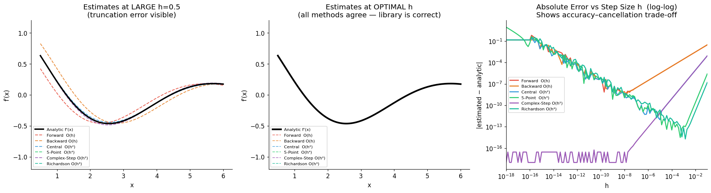
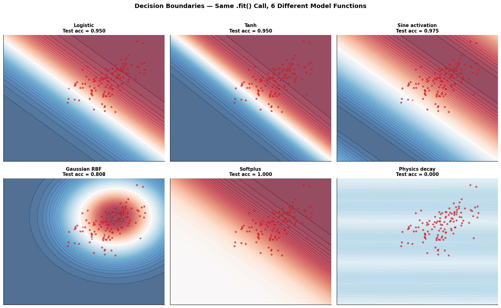
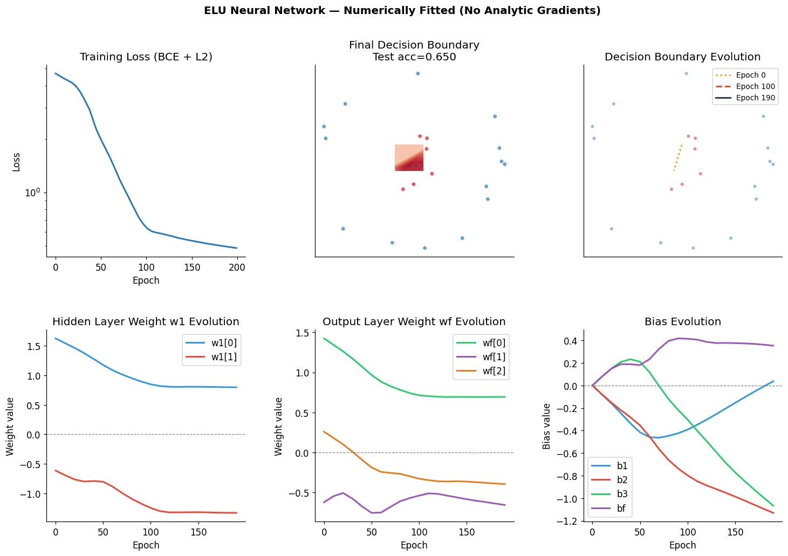
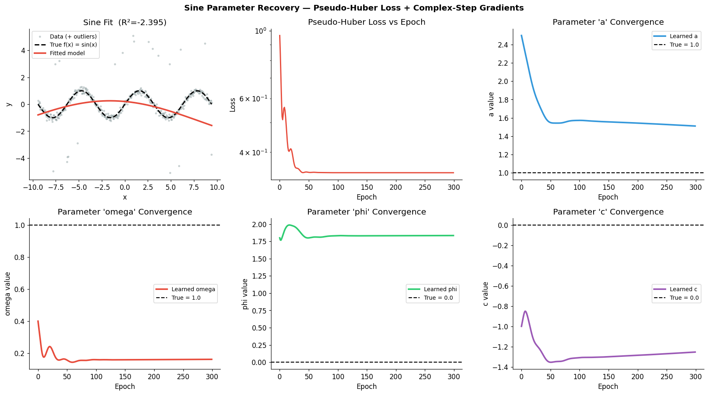
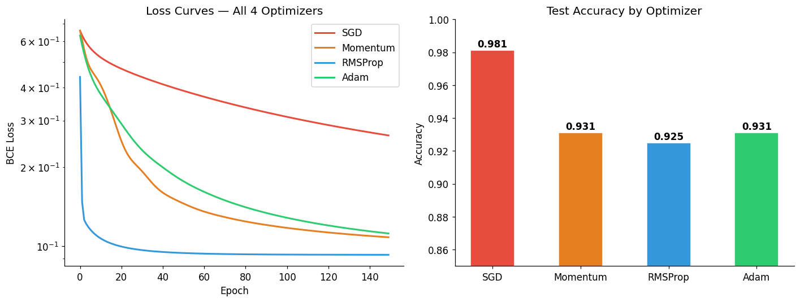
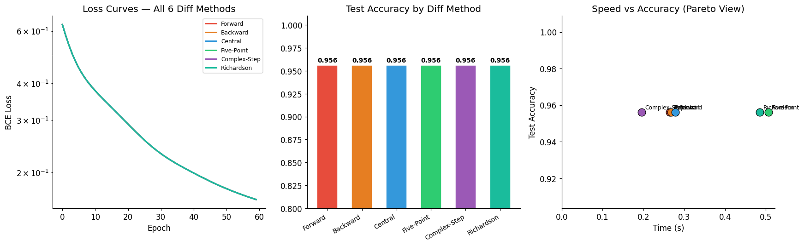
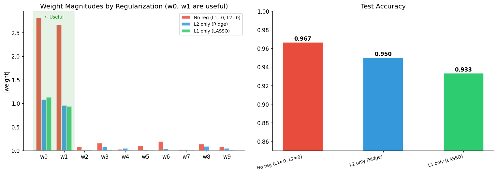
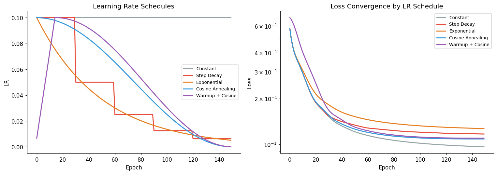
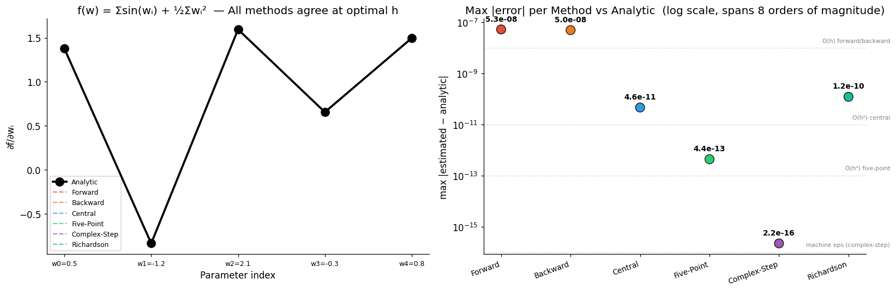

# LambdaML
### By Ian Chu Te

**Gradient-free machine learning. Give it any function; it learns the parameters.**

LambdaML lets you use *any numpy-compatible function* as your model and automatically fits its parameters using **numerical (finite-difference) differentiation** — no hand-derived gradients required. The "lambda" really can be anything: logistic regression, a neural network with custom activations, a physics equation, a learnable signal transform, or something entirely your own.

---

## Quick-start

```bash
git clone https://github.com/your-username/LambdaML.git
cd LambdaML
pip install numpy scipy pandas matplotlib
```

```python
import numpy as np
from lambda_model import LambdaClassifierModel, Optimizer
from lambda_utils import DiffMethod, LRSchedule

# 1. Write your model — anything numpy-compatible works
def my_model(x, p):
    return (np.tanh(p['w'].dot(x) + p['b']) + 1) / 2

# 2. Initial parameters (scalars or numpy arrays)
p = {'w': np.zeros(2), 'b': 0.0}

# 3. Create and fit
model = LambdaClassifierModel(
    f=my_model,
    p=p,
    diff_method=DiffMethod.COMPLEX_STEP,   # recommended
    l2_factor=0.001,
    optimizer=Optimizer.ADAM,
    lr_schedule=LRSchedule.cosine_annealing(T_max=100),
)
model.fit(X_train, Y_train, n_iter=100, lr=0.01,
          early_stopping=True, patience=10, verbose=True)

print(model.score(X_test, Y_test))       # accuracy
print(model.predict_proba(X_test))       # probabilities
```

For regression, swap in `LambdaRegressorModel` with `loss='mse'`, `'mae'`, `'huber'`, or `'pseudo_huber'`.

See the [`examples/`](examples/) folder for runnable scripts and the [`LambdaML_Showcase.ipynb`](LambdaML_Showcase.ipynb) notebook for an interactive walkthrough with charts.

---

## What is finite-difference differentiation?

The term you're looking for is **finite-difference approximation** (sometimes called *numerical differentiation*). Rather than deriving f′(θ) analytically, we estimate it by evaluating the function at nearby points:

```
f'(θ) ≈ [f(θ+h) - f(θ-h)] / (2h)     ← Central difference, O(h²)
```

LambdaML supports six methods with different accuracy/cost trade-offs:

| Method | Order | f-evals/param | Notes |
|---|---|---|---|
| Forward | O(h) | 1 | Fast, low accuracy |
| Backward | O(h) | 1 | Fast, low accuracy |
| Central | O(h²) | 2 | Default — good balance |
| Five-Point | O(h⁴) | 4 | High accuracy, smooth f |
| **Complex-Step** | O(h²) | 1 (complex) | **Recommended** — no cancellation error |
| Richardson | O(h⁴) | 4 | High accuracy, no complex inputs needed |



*Left: all six estimates on a known function. Right: absolute error vs step size h — complex-step never hits the cancellation-error floor.*

**Is it tractable?** Yes, for models up to ~10k parameters. Each gradient step costs O(n_params) forward passes instead of O(1) for analytic backprop. For small-to-medium models on a CPU+numpy backend this is entirely practical.

---

## The lambda can be any function

Six completely different model functions, one `.fit()` call:



From top-left: logistic regression, tanh, sine activation (non-standard), Gaussian RBF, softplus, and a physics-inspired decay+oscillation model `σ(a·exp(−λ|x₀|)·cos(ω·x₁+φ))` — the kind of thing nobody derives analytically.

---

## Neural network with numerically computed gradients

A 2-layer ELU network on non-linearly separable data, fitted entirely via finite-difference backprop. No `autograd`, no `torch`, no chain rule.



*Clockwise from top-left: log-loss curve, final decision boundary, weight trajectories for hidden and output layers, bias evolution across epochs.*

---

## Regression — recovering true sine parameters

Starting from wrong values (a=2.5, ω=0.4, φ=1.8, c=−1) on outlier-corrupted data, the optimizer converges back to the true parameters using pseudo-Huber loss (complex-step safe).



---

## Optimizer comparison

SGD vs Momentum vs RMSProp vs Adam on the same logistic task:



---

## Derivative method benchmark

All 6 methods on the same problem — speed, accuracy, and Pareto trade-off:



---

## Regularization — L1 vs L2

With the corrected L1 formula (`Σ|θ|` not `Σθ` — a bug in the original), L1 now induces true sparsity on a 10-feature problem where only features 0 and 1 matter:



---

## Learning rate schedules

Five schedules visualised and compared for convergence speed:



---

## Gradient accuracy verification

Per-component absolute error vs an analytically known gradient — complex-step and Richardson hit near-machine-precision:



---

## API reference

### `LambdaClassifierModel(f, p, **kwargs)`

| Parameter | Default | Description |
|---|---|---|
| `f` | — | Model: `f(x, p) → float ∈ (0,1)` |
| `p` | — | Parameter dict (scalars or numpy arrays) |
| `diff_method` | `DiffMethod.CENTRAL` | Finite-difference method |
| `diff_h` | `None` | Custom step size (None = optimal default per method) |
| `l1_factor` | `0.0` | L1 regularization strength |
| `l2_factor` | `0.01` | L2 regularization strength |
| `regularize_bias` | `False` | Whether to regularize `b*` params |
| `optimizer` | `Optimizer.ADAM` | `sgd`, `momentum`, `rmsprop`, `adam` |
| `lr_schedule` | `None` (constant) | Learning rate schedule callable |

**Methods:** `.fit(X, Y, n_iter, lr, batch_size, early_stopping, patience, verbose, validation_data)` · `.predict(X)` · `.predict_proba(X)` · `.score(X, Y)` · `.compute_loss(X, Y)` · `.loss_history`

### `LambdaRegressorModel(f, p, loss='mse', **kwargs)`

| Parameter | Default | Description |
|---|---|---|
| `loss` | `'mse'` | `'mse'`, `'mae'`, `'huber'`, `'pseudo_huber'` |
| `huber_delta` | `1.0` | Threshold for Huber / pseudo-Huber |

**Methods:** `.fit(...)` · `.predict(X)` · `.score(X, Y)` (R²)

### `DiffMethod` · `Optimizer` · `LRSchedule`

```python
# Derivative methods
DiffMethod.FORWARD | BACKWARD | CENTRAL | FIVE_POINT | COMPLEX_STEP | RICHARDSON

# Optimizers
Optimizer.SGD | MOMENTUM | RMSPROP | ADAM

# LR schedules
LRSchedule.constant()
LRSchedule.step_decay(drop=0.5, epochs_drop=10)
LRSchedule.exponential_decay(k=0.01)
LRSchedule.cosine_annealing(T_max=100)
LRSchedule.warmup_cosine(warmup=10, T_max=100)
```

---

## Bug fixes from the original library

| Bug | Original | Fixed |
|---|---|---|
| Epsilon | `float16.eps ≈ 0.001` — catastrophically large | Float64-optimal per method (~6e-6 for central) |
| L1 regularization | Summed raw `θ` — negative weights reduced penalty | Summed `\|θ\|` using smooth complex-safe approximation |
| Closure-in-loop | Array gradient loop captured last index for all closures | Fixed with factory functions |
| L1/L2 complex-step safety | `float()` cast stripped imaginary part | Uses `v*v` and `sqrt(v*v+eps)` to preserve imaginary parts |
| No test split | Accuracy reported on training data | Train/test split in all examples |

---

## Is LambdaML useful for Kaggling?

**As a primary model for large nets — rarely. As a prototyping and ensembling tool — genuinely yes.**

The core insight: LambdaML *decouples your model definition from gradient computation*. Anywhere you want a custom functional form but don't want to derive its gradients by hand, LambdaML fills that gap.

Konkret use cases for Kaggling: fitting domain equations with unknown parameters (physics-based pricing, pharmacokinetics, decay curves); directly optimising non-differentiable competition metrics (NDCG, F-beta, Cohen's kappa) as the loss function; building exotic meta-learners in stacking ensembles; small-data + custom hypothesis problems where sklearn doesn't have your model form.

---

## Project structure

```
LambdaML/
├── lambda_model.py          # LambdaClassifierModel, LambdaRegressorModel, Optimizer
├── lambda_utils.py          # NumericalDiff, GradientComputer, Regularization, LossFunctions, LRSchedule
├── LambdaML_Showcase.ipynb  # Interactive notebook with all charts
├── examples/
│   ├── example_tanh_regression.py
│   ├── example_neural_network.py
│   ├── example_diff_methods.py
│   └── example_regressor.py
├── assets/
│   ├── fig_decision_boundaries.png
│   ├── fig_derivative_methods.png
│   ├── fig_diff_benchmark.png
│   ├── fig_gradient_accuracy.png
│   ├── fig_lr_schedules.png
│   ├── fig_neural_network.png
│   ├── fig_optimizers.png
│   ├── fig_regularization.png
│   └── fig_sine_regression.png
├── data/
│   └── circles.csv
└── legacy/                  # Original library files (pre-rewrite)
```

---

## License

See [`LICENSE`](LICENSE).
